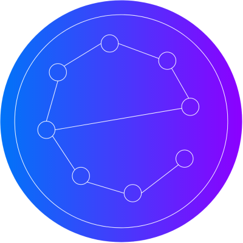

 
 

  
  
  
  
  
 

# easyNeuron

**Table of Contents**

- [easyNeuron](#easyneuron)
  - [Thank you! 🎉](#thank-you-)
  - [Documentation](#documentation)
  - [Current issues ⛔](#current-issues-)

 
 

**Note:** this is an unfinished project, so should not be used yet.
 

**_easyNeuron_** is the new Python module for creating deep learning algorithms and artificial
neural networks started by [Password-Classified](https://github.com/Password-Classified) in 2021. Equipped with datasets to get you started, functions for the calculus and
maths so you don't have to and with infinite model configurations for you to use, **_easyNeuron_** is ready for all your data science projects. Find **_easyNeuron_** at it's [Github Repository](https://github.com/Password-Classified/easyNeuron), with a GitHub.io website coming soon!

 
 

## Thank you! 🎉

I'd link to thank those who have helped make this happen...

- [Naturalis Biodiversity Center](https://github.com/naturalis) and [their DNA database](https://github.com/naturalis/Custom-databases-DNA-sequences). Find their website [here](https://www.naturalis.nl/). They kindly let me include their database in the module [here](https://github.com/naturalis/Custom-databases-DNA-sequences/issues/10).
- Also, a big thanks to all of the fantastic contributors so far:

 
 
 

## Documentation

A GitHub.io website will come soon, with developer and user documentation.

 
 

## Current issues ⛔

Still under heavy initial development, this has some unfinished issues.

- `GradDesc` optimizer is encountering reliability issues.

 

---

This is a very community driven project, so please report any bugs that we can iron out;
we want to make this the best we can. It is also under constant heavy development, so
please provide feedback for any issues you come across so they can be fixed as soon as possible.
